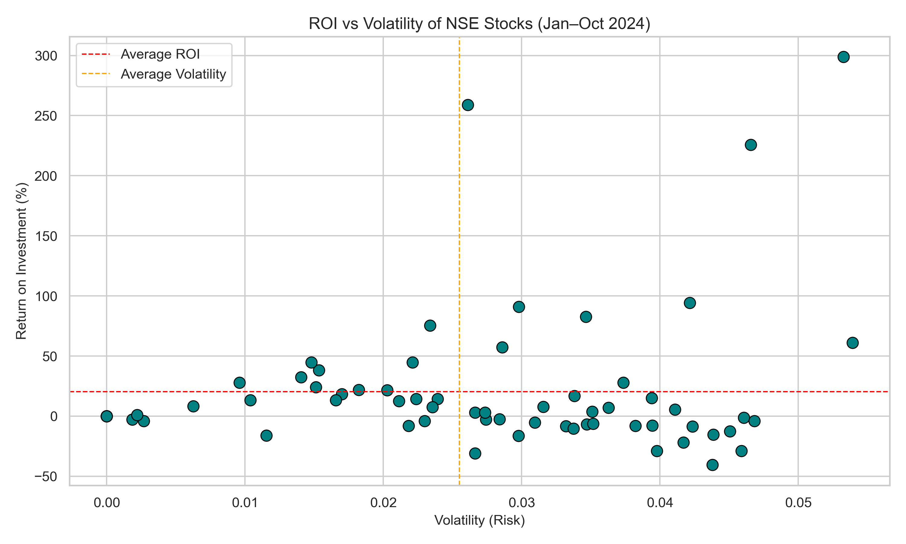
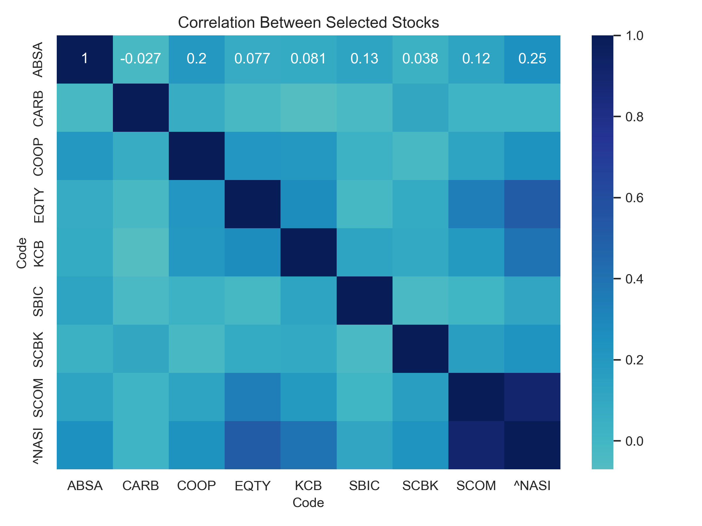

# Optimizing a Mutual Fund Portfolio using NSE Stocks
*A data-driven analysis to identify high-performing, low-risk stocks and design an optimized mutual fund portfolio from the Nairobi Securities Exchange.* 

##  Overview  
This project explores how a mutual fund can be built and optimized using real data from the **Nairobi Securities Exchange (NSE)** covering the period between **January and October 2024**. It follows a data-driven approach starting from stock price trends, moving through return calculations, and ending with portfolio optimization. The analysis focuses on understanding how different listed companies performed over time, identifying those that offered strong returns with manageable risk, and simulating an allocation strategy that balances growth and stability. Ultimately, it demonstrates how data analysis can guide smarter investment decisions in a dynamic market environment.  

---

### Objectives  
The main objective of this project is to design a **data-driven mutual fund investment plan** using stocks listed on the **Nairobi Securities Exchange (NSE)**. This involves analyzing historical price data to evaluate each stock’s performance, measuring both **return on investment (ROI)** and **volatility** to understand potential reward and associated risk. By comparing these two factors, the analysis aims to identify stocks that deliver strong returns with minimal fluctuation ensuring a balanced and resilient investment mix. Finally, the project examines **correlations among selected stocks** to determine how well they diversify one another within a portfolio and contribute to stable long-term growth.  

---

### Data Source  
The analysis is based on stock data from the **Nairobi Securities Exchange (NSE)**, covering the period between **January and October 2024**. The dataset includes daily price movements for all listed companies, capturing the shifts and patterns that shaped the Kenyan market over those ten months.  

  
The dataset can be viewed [**here**](https://data.mendeley.com/datasets/ss5pfw8xnk/1) 

---

### Methodology  
The process began with preparing and cleaning the raw data to ensure accuracy in prices and dates. From there, daily and cumulative returns were calculated to capture how each stock performed over time. Visualization played a key role in uncovering trends highlighting movements, volatility patterns, and standout performers. Finally, the insights from these analyses guided the creation of a simulated mutual fund portfolio, where stock weights were balanced to reflect both growth potential and stability.  

---

### Visual Analysis

The visuals below capture how individual stock behavior and relationships shaped the construction of the mutual fund portfolio. Each plot uncovers a unique layer of the investment story from identifying strong performers to understanding how they interact in the market.

1. **ROI vs Volatility**

This scatter plot visualizes the trade-off between return and risk for every stock. Each point represents one company’s performance on the Nairobi Securities Exchange between January and October 2024.
Several stocks, particularly Carbacid Investments Plc, Bamburi Cement Ltd, and ABSA Bank Kenya Plc stood out for achieving strong returns while maintaining relatively low volatility. These stocks exemplify a balance between profitability and stability the hallmark of a strong, long-term portfolio.

Stocks positioned toward the top-left combine strong returns with lower risk the ideal zone for portfolio inclusion.

---

2. **Correlation Heatmap**

The correlation heatmap highlights how closely different stocks move in relation to one another.
Lower correlation values suggest that the stocks behave more independently  meaning when one dips, another may remain stable or even rise.
In this case, the relatively low correlations among Carbacid Investments, ABSA Bank, and Safaricom Plc indicate strong diversification potential. Such independence between stocks helps cushion the portfolio from market shocks and supports smoother overall performance.

Lighter shades indicate weaker correlations, representing greater diversification potential across the selected stocks.

---

### Insights and Observations

The analysis revealed a clear pattern: strong-performing stocks with moderate volatility consistently outperformed more erratic ones.
Companies such as Carbacid Investments, Bamburi Cement, and ABSA Bank emerged as reliable long-term candidates, offering both growth and resilience.
Meanwhile, some higher-volatility stocks offered impressive short-term gains but carried greater uncertainty, making them less suited for stable mutual fund inclusion.

The correlation findings emphasized that diversification is the key to portfolio stability.
Stocks that don’t move together reduce the impact of market fluctuations creating a more resilient investment structure over time.

---

## Conclusion

This project applied a data-driven approach to designing a mutual fund plan using stocks from the Nairobi Securities Exchange.
By evaluating each stock’s ROI and volatility, and then analyzing their correlations, the study identified a set of assets that balance growth potential with manageable risk.
The findings demonstrate that combining high-performing yet low-correlated stocks can deliver sustainable, long-term returns while minimizing exposure to market uncertainty. 